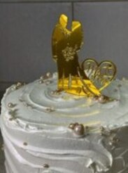
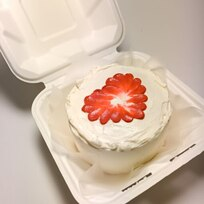

# CV Solodkova Polina

---


## Solodkova Polina Victorovna

I'm 19 years old. I graduated from the Mogilev City Gymnasium No. 1, now I am studying at the Belarusian-Russian University in the 2nd year. I am ready to learn new things and practice my existing skills. My main qualities are responsibility, stress tolerance and hard work

---

## Skills

- Languages spoken: Russian (native), Belarusian (native), English
- English level: B1
- Programming languages: C#, SQL, C++, Java

---

## Work experience

### Transport Company "ВальдВикТранс"

June 2023 - August 2023

Responsibilities of the logistician and dispatcher

### Cafe-bakery "Пирогова"

June 2023 - January 2024

Responsibilities of a pastry baker

---

## Portfolio

```
<section id="experience">
      <div style="margin: 0 auto; width: 500px">
        <h2>Опыт работы</h2>

        <h2>Транспортная компания "ВальдВикТранс"</h2>
        <span>Июнь 2023 - Август 2023</span>
        <p>Обязанности логиста и диспетчера</p>

        <h2>ИП "Пирогова"</h2>
        <span>Июнь 2023 - январь 2024</span>
        <p>Обязанности пекаря-кондитера</p>
      </div>
    </section>

```

### Wedding cake



### Bento-cake



### Children's cake


[See more](https://www.instagram.com/malt_cake?igsh=cW1wb3QxbHI1Z3Bt)

---

## Contacts

[Send e-mail](mailto:polina.soldkova507@gmail.com)

[My VK](https://vk.com/solodkova1999)

[Telegram](https://t.me/malt_sun)

---

Copyright Solodkova Polina
